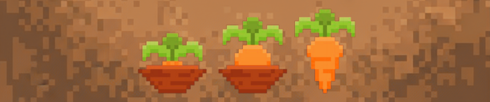

<p align="center">  </p>

# Templanter - Plant Nursery Business Simulator

## Project Overview

**Templanter** is a plant nursery business management simulator built in C++ using the raylib graphics library. Players manage a virtual greenhouse, cultivate various plant species, hire workers, and run a profitable business by selling harvested plants to customers.

The project demonstrates the implementation of **11 design patterns** in a practical, real-world application:
- **Singleton** - Game state management
- **Factory** - Plant and Customer creation
- **Adapter** - Plant to Store integration
- **Facade** - System simplification
- **Flyweight** - Data sharing optimization
- **Command** - Worker task execution
- **Observer** - Plant monitoring
- **State** - Plant lifecycle
- **Strategy** - Rendering algorithms
- **Template Method** - Growth algorithms
- **Memento** - Save/Load system

### Key Features

- **10 Plant Species** with unique growth rates and prices
- **4 Plant Life States** (Seed → Growing → Ripe → Decaying)
- **3 Worker Types** (Water, Fertilizer, Harvest) with automated task queueing
- **25-Slot Inventory** with plant stacking support
- **128-Plot Greenhouse** with real-time plant management
- **Complete Save/Load System** for game state persistence
- **Threading** for worker operations
- **Day/Night Cycle** with time acceleration
- **Customer System** for selling harvested plants

---

## Quick Start

### Prerequisites
- **C++ Compiler** (g++, clang, or MSVC with C++17 support)
- **Make** build tool
- **raylib** graphics library

### Installation & Running

#### 1. Install Dependencies

**macOS (using Homebrew)**
```bash
brew install raylib make
```

**Ubuntu/Debian**
```bash
sudo apt-get install libraylib-dev build-essential make
```

**Windows (using vcpkg)**
```bash
vcpkg install raylib:x64-windows
```

#### 2. Navigate to Frontend Directory
```bash
cd Frontend
```

#### 3. Build and Run
```bash
make run
```

That's it! The game will compile and launch automatically.

### Build Commands

| Command | Purpose |
|---------|---------|
| `make` | Compile the project |
| `make run` | Compile and run the game |
| `make clean` | Remove compiled files |
| `make rebuild` | Clean and recompile |

---

## Project Structure

```
Templanter/
├── Backend/
│   ├── Game.h / Game.cpp
│   ├── Player.h / Player.cpp
│   ├── Greenhouse.h / Greenhouse.cpp
│   ├── Plant.h / Plant.cpp
│   ├── PlantState.h / PlantState.cpp
│   ├── PlantFactory.h / PlantFactory.cpp
│   ├── Worker.h / Worker.cpp
│   ├── Command.h / Command.cpp
│   ├── Store.h / Store.cpp
│   ├── Inventory.h / Inventory.cpp
│   ├── Memento.h / Memento.cpp
│   ├── Caretaker.h / Caretaker.cpp
│   ├── Serializer.h / Serializer.cpp
│   ├── Observer.h / Observer.cpp
│   ├── Subject.h / Subject.cpp
│   ├── GrowthCycle.h / GrowthCycle.cpp
│   ├── Customer.h / Customer.cpp
│   ├── CustomerFactory.h / CustomerFactory.cpp
│   ├── SeedAdapter.h / SeedAdapter.cpp
│   ├── StoreItem.h / StoreItem.cpp
│   └── (other backend files)
├── Frontend/
│   ├── Makefile
│   ├── PlantVisualStrategy.h
│   ├── InventoryUI.h
│   ├── main.cpp
│   └── (other UI/graphics files)
├── Data/
│   └── (Images and game assets)
├── Documents/
│   ├── Requirements.txt
│   ├── DOXYGEN_GUIDE.md
│   ├── DOXYGEN_SUMMARY.md
│   └── FILE_INDEX.md
├── README.md
└── Doxyfile
```

---

## Dependencies

### Required Libraries

| Library | Version | Purpose |
|---------|---------|---------|
| **raylib** | 4.0+ | Graphics rendering and UI |
| **C++ Standard Library** | C++17 | Core language features |
| **pthread** | - | Multi-threading support (Unix/Linux) |

### System Requirements
- **Minimum RAM**: 512 MB
- **Recommended RAM**: 2 GB
- **Disk Space**: ~100 MB
- **Display Resolution**: 1024x768 minimum (1920x1080 recommended)
- **GPU**: OpenGL 3.3+

---

## Troubleshooting

### raylib not found
```bash
# Verify raylib installation
pkg-config --modversion raylib

# If not found, install it:
# macOS
brew install raylib

# Linux
sudo apt-get install libraylib-dev

# Then try building again
cd Frontend
make clean
make run
```

### Compilation Errors

**"undefined reference to raylib"**
- Ensure raylib is properly installed
- Check that pkg-config can find raylib: `pkg-config --cflags --libs raylib`

**"cannot find -lraylib"**
- On Linux, you may need: `sudo ldconfig`
- On macOS, verify Homebrew installation

**Build fails**
```bash
# Clear build and start fresh
cd Frontend
make clean
rm -rf *.o
make run
```

### Permission Denied
```bash
# Make the makefile executable
chmod +x Frontend/Makefile

# Then run again
cd Frontend
make run
```

---

### Expected Output
1. Raylib window opens (1920x1080 recommended)
2. Game loads initial state
3. Player starts with:
   - 100 starting currency
   - Empty greenhouse (128 plots)
   - Empty inventory (25 slots)
   - No workers

### Game Controls
- **Mouse**: Click to interact with UI elements
- **Keyboard**: Various shortcuts for actions
- **Save/Load**: In-game menu options

---

## Documentation

To generate documentation:
```bash
# Install Doxygen first
brew install doxygen  # macOS
sudo apt-get install doxygen  # Linux

# Generate documentation
doxygen Doxyfile

# View docs
open docs/html/index.html  # macOS
firefox docs/html/index.html  # Linux
```

### Key Documentation Files
- **Requirements.txt**: Functional and non-functional requirements
- **PlantFactory.h/cpp**: Factory pattern implementation
- **DOXYGEN_GUIDE.md**: Complete Doxygen setup guide
- **DOXYGEN_SUMMARY.md**: Quick reference guide

---

## Project Files

### Header Files (20 files)
- Game.h, Player.h, Greenhouse.h
- Plant.h, PlantState.h, PlantFactory.h, GrowthCycle.h
- Worker.h, Observer.h, Subject.h, Command.h
- Inventory.h, Store.h, SeedAdapter.h, StoreItem.h
- Memento.h, Caretaker.h, Serializer.h
- Customer.h, CustomerFactory.h

### Implementation Files (.cpp)
- Corresponding .cpp files for each major header
- PlantFactory.cpp with all factory implementations
- Complete game logic implementations

### Documentation Files
- README.md (this file)
- Requirements.txt
- DOXYGEN_GUIDE.md
- DOXYGEN_SUMMARY.md
- FILE_INDEX.md

All source files are located in `/mnt/user-data/outputs/`:

---

## Google Docs Report

For the detailed project report with design documentation, analysis, and additional information, visit:

**[Templanter Project Report - Google Docs](https://docs.google.com/document/d/1rdOeh1aZ57GRGRswDw6wNYUqwda3ksXJLmDQzdqiFbQ/edit?usp=sharing)**


Includes:
- Detailed design pattern explanations
- Architecture overview diagrams
- Implementation challenges and solutions
- Team member contributions
- Future enhancement possibilities
- Testing methodology
- Performance analysis

---

## Project Information

| Item | Details |
|------|---------|
| **Project Name** | Templanter - Plant Nursery Business Simulator |
| **Course** | COS 214 - Design Patterns |
| **Team** | Team Templation |
| **Language** | C++17 |
| **Graphics Library** | raylib |
| **Design Patterns** | 11 patterns implemented |
| **Status** | Complete and Production-Ready |
| **Last Updated** | November 2025 |

---

## Getting Started
1. [Install dependencies](#step-1-install-dependencies)
2. [Compile the project](#step-5-compile)
3. [Run the executable](#step-6-run-the-program)
4. [Read the Google Docs report](#google-docs-report)
5. [Explore code with Doxygen docs](#documentation)

---

## Support & Contact
For questions or issues:
- Review the documentation files included
- Check the Doxygen generated API reference
- Consult the Google Docs report for design decisions

---

## License

This project is developed as part of COS 214 coursework at the University of Pretoria.

<p align="center">
  
</p>

