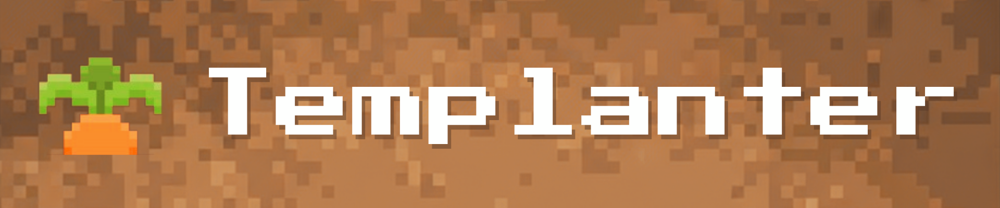

# TEMPLANTER
## A Plant Nursery Simulator

  

> _"A greenhouse simulator built from design patterns — not dirt."_

---

**A 2D Greenhouse Management Simulation built with C++ & Raylib**  
A simulation and management system featuring 11 software design patterns, where you grow plants, manage workers, and serve customers.  

---

## Features

- **Dynamic Plant Growth System** — Manage various plant types through complete lifecycle stages
- **Worker Management System** — Assign tasks such as watering, fertilizing, and harvesting
- **Customer Interactions** — Browse available plants, make purchases, and manage customer relationships
- **Flexible Inventory Tracking** — Monitor plant health status and availability
- **Day/Night Cycles** — Enables save/load functionality for different play sessions
- **Scalable Architecture** — Built with design patterns for easy specialization and generalization

---

## Design Patterns Implemented

| Pattern | Application |
|---------|-------------|
| **Singleton** | Game class ensures single instance of game state |
| **Factory** | PlantFactory and CustomerFactory create specific object types |
| **Adapter** | Converts Plant interface to StoreItem interface for sales |
| **Facade** | Demo class simplifies access to complex subsystems |
| **Flyweight** | Shares immutable customer data across multiple objects |
| **Command** | Encapsulates worker tasks like watering and harvesting |
| **Observer** | Greenhouse notifies workers when plants need care |
| **State** | Manages plant lifecycle (Seed, Growing, Ripe, Decaying) |
| **Strategy** | Defines interchangeable rendering algorithms for plants |
| **Template Method** | Defines plant growth algorithm skeleton for subclass specialization |
| **Memento** | Enables save/load functionality for game state restoration |

---

## System Architecture

The system is organized into three main subsystems:

**Greenhouse Subsystem** — Manages plant creation, growth cycles, health status, and inventory tracking. This is the core of the simulation.

**Staff Subsystem** — Handles worker entities assigned tasks such as watering, fertilizing, harvesting plants, and assisting customers.

**Customer Subsystem** — Manages customer entities who can browse available plants, interact with staff, and make purchases.

---

## Tech Stack

| **Front-End** | **Back-End** |
|---------------|--------------|
|  |  |

**Version Control** — Git & GitHub with feature branch workflow  
**Documentation** — Doxygen  
**Testing** — Unit tests

---

## Team: Templation

| Name | Student ID |
|------|-----------|
| Jo Reardon | u24597652 |
| Paul Hofmeyr | u24618391 |
| Finnley Wyllie | u24754120 |
| Mutombo Kabau | u24957102 |
| Alessandro Paravano | u24713122 |

University of Pretoria — COS 214 Final Project  
November 2025

---

  

